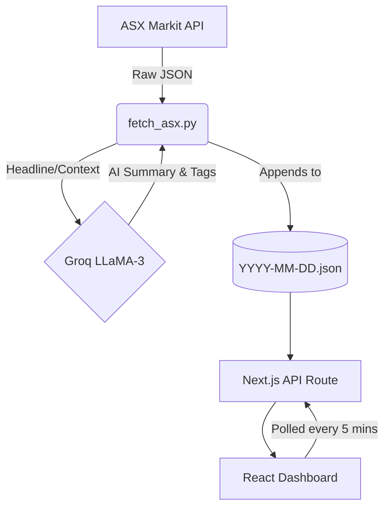

# High-Level Design (HLD)
## Vitti ASX Intelligence Dashboard

### 1. Overview
The Vitti ASX Intelligence Dashboard is an automated pipeline designed to track, summarize, and display market-moving announcements from the Australian Securities Exchange (ASX).

### 2. Architecture Goal
The system is built on a **Decoupled Serverless Architecture**. It segregates the heavy lifting (data fetching and AI processing) from the presentation layer (the Next.js User Interface).

### 3. Core Components

#### A. The Data Engine (Python Pipeline)
*   **Source:** Polls the official MarkitDigital ASX JSON API.
*   **Processing:** Identifies newly released announcements.
*   **AI Integration:** Forwards announcements to the **Groq API** (running LLaMA 3.3). The AI reads the headline and outputs:
    1.  A 3-bullet-point summary.
    2.  Semantic tags (e.g., "Mining", "Dividend").
    3.  A "Bullish" or "Bearish" sentiment score.
*   **Storage:** The final enriched data is saved directly as a JSON file (`logs/YYYY-MM-DD.json`).

#### B. The Presentation Layer (Next.js 14)
*   **Framework:** Built entirely on Next.js App Router with React 18.
*   **Backend-for-Frontend (BFF):** A local API route (`/api/logs/[date]`) acts as a bridge, reading the JSON log files from the server's disk and serving them to the browser securely, bypassing CORS constraints.
*   **Client Interface:** A highly responsive dashboard using Tailwind CSS ("Midnight Intelligence" theme). It features client-side text filtering, layout toggling, and theme switching.

### 4. System Flow Diagram

### 5. Automation Strategy
*   **Extraction:** A GitHub Actions workflow runs the Python engine every **15 minutes** during the critical market opening window (**8:00 AM - 11:45 AM AEST**, Monday-Friday). This ensures early-morning announcements are captured and summarized rapidly.
*   **Display:** The Next.js dashboard uses a `setInterval` hook to poll the local API route every 5 minutes. As the Python script appends new items to the JSON file, the dashboard automatically updates without requiring a page refresh.
